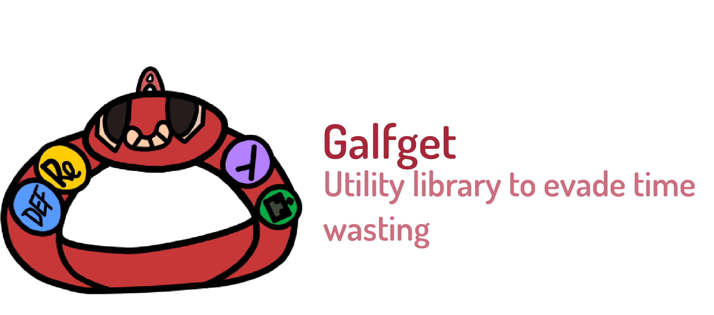

# Galfgets - General purpouse functions to recycle

This is a repo to store all the functions, regular expressions and utilities in general implemented throught various projects in order to reuse it, instead waste time in the implementation of it again.

## Requirements
* [Python 3.7 or greater](https://www.python.org/)
    * [Pandas](https://pandas.pydata.org/)
    * [Numpy](https://numpy.org/)
    * [Sklearn](https://scikit-learn.org/stable/)
    * [Seaborn](https://seaborn.pydata.org/)
    * [Matplotlib](https://matplotlib.org/)

## What is inside of this repo?
### .dotfiles folder
This folder contains all my basic custom configurations from the programs that usually I use to develop.
Its a backup to prevent the waste of time in case of I need to use specifics operative system or likely circustances.
Actually it contains dotfiles for:
* .bashrc file
* .gitconfig file
* .vimrc file
* .settings file from visual studio; Remember to update the name to .settings before use it!

### firmware
Same reasons that in the previous section, I usually work with a custom keyboard and I can 
personalize the layers, create custom macros, etc. So in order to keep a backup if everything
go wrong or anyone want to use the same config, the needed files are here to use or change in
the way you want :D!.

### graphics
Sometimes I need to make some frontend dev jobs, and I like to keep all the custom 
palletes or colors and the place what I took in order to go again and making all the 
proccess a little fast, so you can see the color_tones.svg that its a kind of resume image
that contains the colors, and all the information that you need will be in the colors_data.csv file.

### Python submodule
* Lambda functions; Lambda functions usually used in python projects.
* Regular expressions; Regular expressions usually used in python projects.
* Data analysis tools; Tools for process elements related to the field of data analysis.    
    * Tools for processing datasets
    * Tools for processing decision trees/random forests
    * Tools for processing machine learning models
* Graphics and representation; Variety of functions to retrieve graphical feedback or representations more expressive that by standard mediums.
    * Console feedback tools
    * Confusion matrix representation tools
* Data structure tools
    * Tree search tools
* System tools; Typical functions to perform native system operations like ls or ps. 
* List tools; Tools to perform complex operations in lists.

### Bash submodule
* Bash functions useful to correct mistakes (ie: expired pubkeys)
